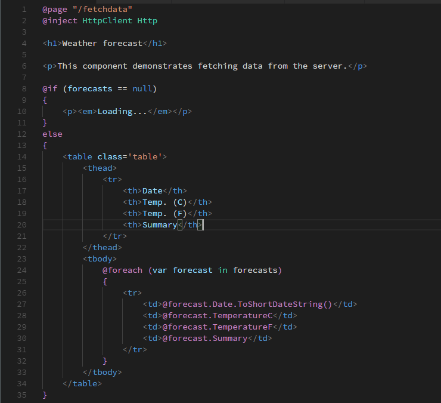
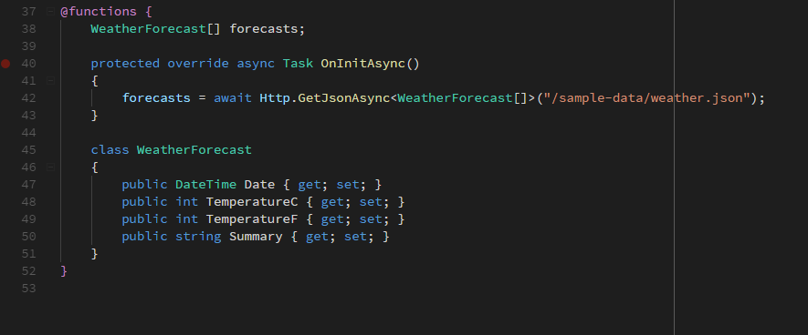

# CAVEAT EMPTOR

This repository is _unmaintained_ and exists only to mirror the MIT licensed project that once existed at github.com/austincummings/razor-plus so other projects dependent upon it continue to work. This may disappear entirely or find a new home in the future.

# Razor+

Improved Razor syntax colorization for VS Code.

## Features

Supports Razor and Blazor directives.

Support for the `@functions` directive.

## Requirements

None

## Extension Settings

None

## Known Issues

- Implicit Razor expressions `@doSomething()` aren't colored using the C# syntax.
- Email addresses aren't colored correctly
- `@foreach` directives aren't colored correctly
- HTML nested in Razor code blocks `@{}` isn't colored as HTML
- `@await` isn't colored as C#
- Razor expressions in HTML attributes aren't colored

## Release Notes

## 0.1.4
* Improve using directives by using newfound knowledge of regex lookaheads
* Add keywords and category to package.json
* Add LICENSE - MIT
* Support escaped "@" signs

### 0.1.3

Change name to `Razor+`

### 0.1.2

- Fix `@for` loop coloring
- Fix razor comments

### 0.1.1

Fix broken readme images

### 0.1.0

Initial release
